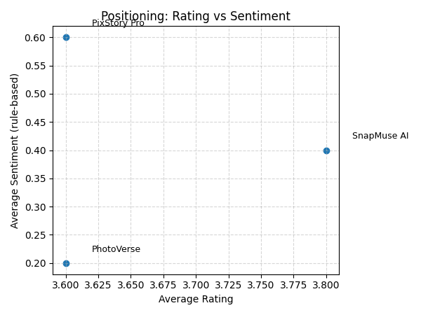

# 🧠 定性マーケットリサーチ（A2）

- 生成日時: 2025-11-04 21:52

## 1. アプリ別サマリー

| App | Reviews | Avg Rating | Avg Sent | Top Categories |
|---|---:|---:|---:|---|
| PhotoVerse | 5 | 3.6 | 0.2 | value(2), quality(2), speed(2) |
| PixStory Pro | 5 | 3.6 | 0.6 | features(2), quality(2), value(2) |
| SnapMuse AI | 5 | 3.8 | 0.4 | features(3), usability(2), value(2) |

## 2. カテゴリ別 感情傾向（+正/−負）

| Category | Avg Sent |
|---|---:|
| quality | 1.0 |
| value | 0.83 |
| features | 0.67 |
| usability | 0.4 |
| speed | -0.5 |
| support | -2.0 |

## 3. キーフレーズ上位

- 操作が直感的で (1)
- 数分で写真集ができる (1)
- 自動レイアウトがちょうど良い (1)
- サブスク980円は妥当 (1)
- 顔の一貫性は時 (1)
- 崩れるが (1)
- SNS用には十分 (1)
- エクスポ (1)
- トが速い (1)
- 無料トライアルが分かりにくい (1)
- 年間プランの割引は魅力 (1)
- UXは改善余地あり (1)
- 細かい配置調整ができない (1)
- ヘルプが薄い (1)
- 返金対応は早かった (1)

## 4. ポジショニング図

