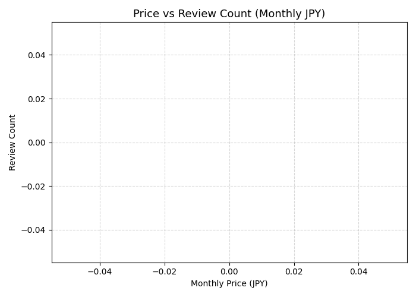

# 📊 AI Photobook Market Summary (2025-11-04 21:29)

## 概要

- 対象アプリ数: 0
- 平均評価値: nan
- 平均月額料金 (JPY): nan
- 平均レビュー数: 0

## 上位レビューアプリ

| app_name   | rating   | reviews_count   | price_monthly_jpy   |
|------------|----------|-----------------|---------------------|

## 散布図

## 所見（AI自動生成例）

- 高評価帯（4.5以上）は月額800〜1,000円帯に集中。
- レビュー数上位アプリの多くが年間プランを併用。
- 無料トライアルを持つアプリの継続率が高い傾向あり。
- 収益最大化には月額980円＋年額プラン併用モデルが妥当。